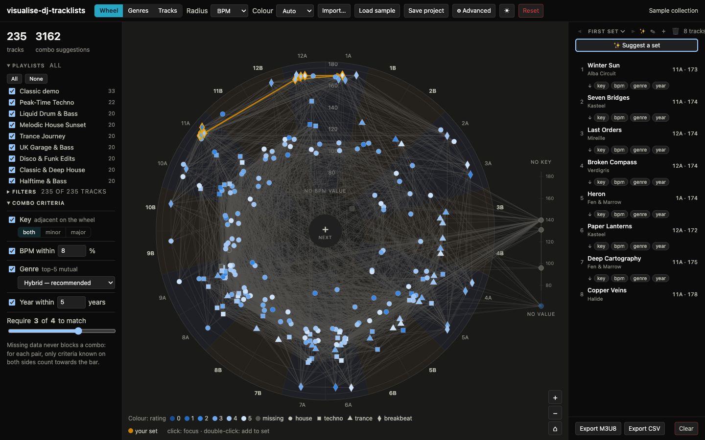
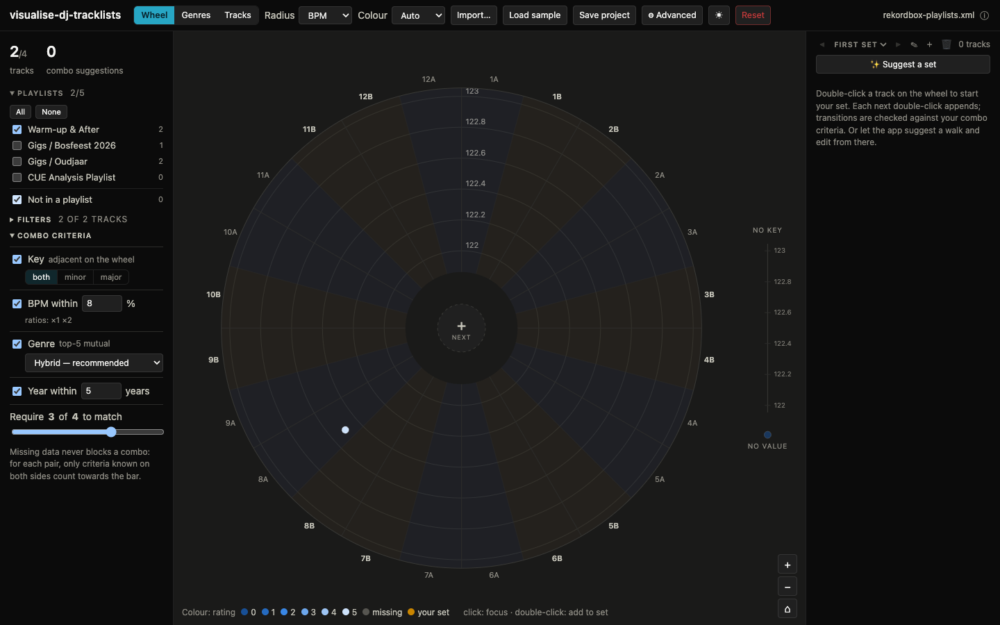
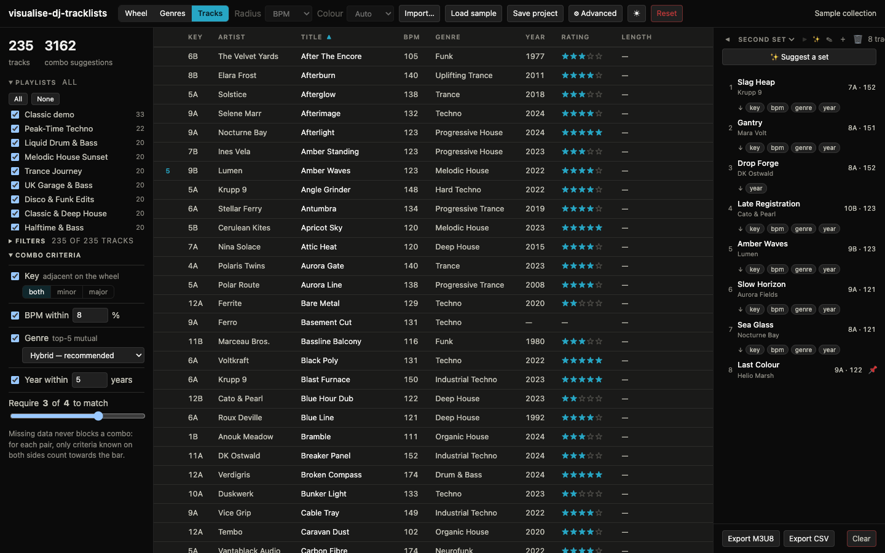
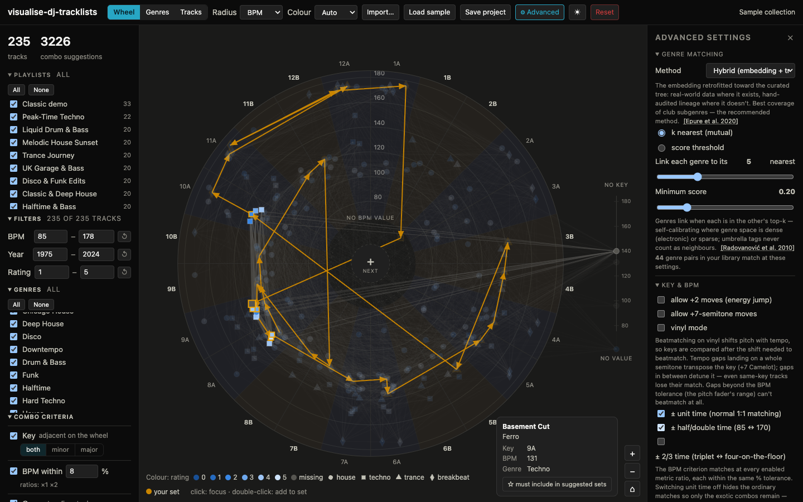
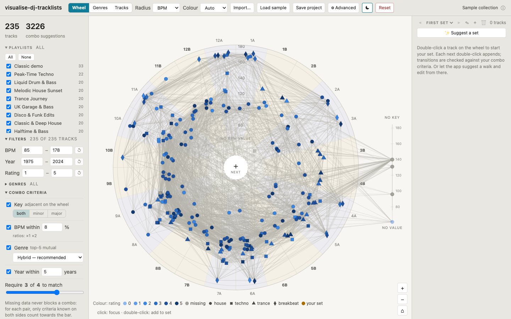
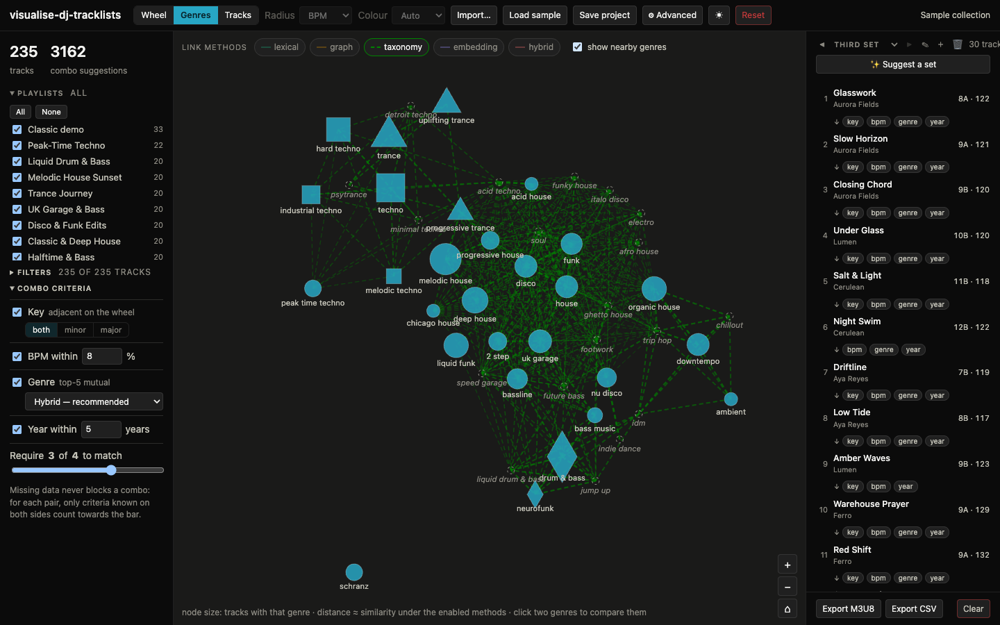

# visualise-dj-tracklists

A local-first web app that shows a DJ library as a **graph** instead of a list: tracks are
nodes on a Camelot-wheel polar view, suggested combos are edges computed from tunable
matching criteria (key adjacency, BPM, genre similarity, year), and a tracklist is a
visible **walk** woven through that structure.

Your library never leaves your machine — there is no backend, no account, no upload.



## What it does

- **Import** a Rekordbox XML collection export, a **Rekordbox playlist TXT export**
  (the UTF-16 tab-separated table — it becomes the library, a ready-checked playlist
  named after the file, _and_ your set in playlist order), a CSV, tagged audio files
  (ID3/Vorbis/MP4, read in the browser), or an **M3U8 playlist** — M3U8s become your
  set, matched against the library, and entries that aren't in the library yet pick
  up their metadata when you import the collection XML later. The **Load sample**
  button loads one **Sample collection**: ten themed fictional crates plus the
  classic demo, each as a playlist, behaving exactly like an imported collection.
- **Work per playlist**: any collection with playlists (XML or the sample) starts
  with an **empty wheel** and a Playlists panel on the left — toggle the playlists
  you want (plus a "Not in a playlist" bucket for the rest) instead of drowning in
  2000 nodes.
- **See the web**: key as angle on a 24-slot Camelot wheel (every harmonically compatible
  key angularly adjacent, minor/major sectors tinted), switchable radius (BPM / rating /
  year), node colour on its own axis. Tracks without a key sit in a labelled gutter at
  their true BPM. Zoom to resolve detail — node disks keep their size while the
  structure magnifies. Node **shapes** (circle, square, triangle, …) carry a class of
  your choosing: **genre families** from the curated genre tree (the default —
  deterministic, and never reshuffled by criterion changes), your selected
  **playlists** (first one wins), or similarity **clusters** in the hybrid space —
  capped by a "max symbol classes" setting.
- **Nodes that hold still**: every track's angle is a property of your _library_,
  not of the current filters — filtering and playlist toggling only make nodes
  appear or disappear, leaving gaps in the same-key fans, so nothing ever shuffles
  around while you narrow down. Same-key fans spread evenly in a **stable random
  order** (no artificial BPM sweep); a ↻ button re-shuffles them, and the spread
  itself scales from 0 to 1. The one deliberate exception is the **radial axis**:
  tighten the min/max of the value shown as radius and the rings, ticks and radii
  glide to the new range (and back, via each filter's ↺ reset). The legend lists
  only the genre classes you can currently see, and disappears when the symbols
  make no distinction. Rating and year rings only sit on whole values.
- **Map the genres**: a second central view (Wheel | Genres | Tracks switch) lays your
  library's genres out with a force simulation — screen distance approximates the
  distance measure, and you can **drag the nodes around** to jiggle the clusters.
  Toggleable per-method edge overlays show where the similarity methods agree and
  disagree — the overlay for your **active criterion method draws exactly the pairs
  the criterion links**, k/threshold included. **Click two genres to compare them**:
  a docked card locks with every method's score for the pair (hovering a single edge
  still works); a "show nearby genres" toggle ghosts in related genres you don't own
  yet.
- **Browse the tracks**: the third central view is a classic sortable table of the
  selected playlists — every column sortable (keys in Camelot order, missing values
  last, ratings as stars), and the sort survives view switches. Pick **which columns
  show** (Album, Date added and Length join the classic seven) in the advanced menu
  and **drag the headers** to reorder them. Clicking a row selects it everywhere and
  highlights its combo neighbours; the leading **＋ cell appends to the set and turns
  into the track's position number(s)** once it's in. Per-row toggles mark a track
  **essential** (★) or pin it as the **opener/closer** of generated sets (a pinned
  track's ★ lights up by itself — it's included by construction); tagged tracks wear
  a subtle ring on the wheel.
- **Filter**: BPM / year / rating ranges plus a genre checklist **scoped to the
  selected playlists** decide what participates in the graph at all, and a
  **both/minor/major** switch beside the key criterion shows one Camelot ring only —
  the excluded ring's sector tint fades out so the wheel visibly answers. Ranges
  pre-fill with the whole numbers just outside the selected playlists' actual
  extremes, reset to them with a ↺ per range (and whenever you toggle playlists), and
  a min can never cross its max. The filter header counts visible tracks against the
  playlist selection.
- **Tune the criteria**: key / BPM / genre / year each toggleable and ranged; an edge
  appears when at least _N_ of the enabled criteria match. Missing metadata never blocks
  a combo. The BPM tolerance defaults to **±8%** — the pitch range of a classic
  Technics fader — and goes down to **0% for exact matches**. BPM matches at every
  enabled **metric ratio**: unit time (1:1, on by default — switch it off to isolate
  the exotic combos), **half/double time** (85 ↔ 170), and **2/3 time** (128 ↔ 192,
  triplet ↔ four-on-the-floor). The **+2** and **+7-semitone** key moves toggle
  independently; **vinyl mode** models the physics of beatmatching on turntables —
  pitch shifts the key with the tempo, so keys are always compared _after_ that shift:
  same-key tracks at different tempos detune apart, and clean-semitone gaps transpose
  into new matches. Toggling it visibly rewires the graph.
- **Match genres that aren't spelled the same**: six selectable similarity methods
  (see below) — the dropdown sits right in the combo panel, sourced explainers and
  parameters in the advanced menu. The criterion defaults to the **hybrid** method
  with **mutual top-k** matching — each genre links to its k nearest genres in
  _your_ library when the closeness is mutual — which self-calibrates across dense
  (electronic) and sparse genre regions; a classic score threshold remains available.
  Umbrella tags ("Electronic", "Dance") never drive a match, and multi-genre fields
  ("House / Techno") match through their best component.
- **Weave a set**: click to focus (a card shows the selection's details, docked
  bottom-right), double-click to append (the same track can appear twice — just not
  back-to-back), or press the wheel's centre **＋ next** button to slot in the best
  next track (it inserts _between_ tracks when your selection sits mid-set; the
  selection then follows the pick, so pressing again continues from the head). A
  dashed **retry** ring around the hub swaps the last pick for a different one — and
  it never just vanishes: when the matching alternatives run out it morphs into a
  warning-coloured **force retry** with a small **⟲** that restores the original
  pick, and once everything has been tried only the ⟲ remains. When no track matches
  your criteria from there, the hub itself pulses into a **force** state — a forced
  pick gently prefers keys a **±2/±7-semitone move** away — and it greys out once
  every visible track is in the set. **Cmd+Z / Cmd+Shift+Z** undo and redo set edits
  and selection changes.
- **Keep several sets — they ARE the suggestion browser**: the set panel's header
  reads **◀ [set name] ▶** over up to **eight named sets** — ＋ starts a "Second Set"
  (then Third, …), ✎ renames inline, and a subtle ✨ badge marks a set that is
  untouched generator output. **✨ Suggest** regenerates such a set **in place**
  (Cmd+Z steps back through the previous suggestions) and starts a **new set** when
  the current one is hand-edited — your work is never overwritten. All sets persist
  with the project.
- **Shape the generated order**: pick the opening/closing track and the essential
  (must-include) tracks in the **Tracks view** — the same pins as 📌 on the set's
  first/last rows; with both ends set, the walk grows from both ends inward. The
  advanced menu's **Set & suggestions** section lists those choices (with ✕ to
  remove), and sets the **BPM progression** — steady, rising, falling, or a sawtooth
  that builds and drops in cycles — plus an **adventurousness** setting for how much
  dissonance the generator embraces.
- **Make it yours**: the advanced settings live in the right panel (swapping with
  the set) as collapsible sections that start folded and **remember what you keep
  open**, so the wheel reacts live while you tune without a wall of controls. The
  **colour scheme** (blue / aqua / violet) tints the whole app — accents, the set
  path, the genre map — not just the nodes; a ☀/☾ switch flips between the dark and
  light theme (fresh visitors follow the system preference). The top bar stays lean:
  the imported collection's name plus an ⓘ whose tooltip holds the import details.
- **Take it with you**: export the set as M3U8 (Rekordbox re-imports it) or CSV; save
  the whole project as JSON — every export asks for a filename first. Everything
  autosaves to the browser; a Reset button (with confirmation) wipes the slate.









## Genre similarity

"Tech House" and "Techno" are different strings but not unrelated music. The genre
criterion supports six methods (picked in the combo panel; parameters and sourced
explainers in advanced menu → Genre matching), implementing the
recommendations of a literature review on genre distance measures
([docs/designs/design-v4.md](docs/designs/design-v4.md) has the design; the research
reports live in [docs/research/](docs/research/), and
[docs/science/genre-distance-measures.md](docs/science/genre-distance-measures.md)
documents the technical choices, the evidence behind them, and the open questions):

| Method             | How it works                                                                                  | Data                                                              | Grounding                            |
| ------------------ | --------------------------------------------------------------------------------------------- | ----------------------------------------------------------------- | ------------------------------------ |
| Exact              | normalized labels must be identical (aliases like DnB → Drum & Bass still unify)              | none                                                              | Schreiber 2015 (tag normalization)   |
| Lexical            | token-set Jaccard after normalization ("melodic house" ~ "house")                             | none                                                              | —                                    |
| Graph              | decay^(shortest path) over a curated genre-relation graph                                     | [src/data/genre-graph.json](src/data/genre-graph.json) — editable | Rada et al. 1989                     |
| Taxonomy           | Lin similarity over a rooted genre DAG with intrinsic information content                     | [src/data/genre-tree.json](src/data/genre-tree.json) — editable   | Lin 1998; Seco et al. 2004           |
| Embedding          | mutual-proximity-corrected similarity between tag co-occurrence embeddings                    | [src/data/genre-embedding.json](src/data/genre-embedding.json)    | Levy & Goldberg 2014; Schnitzer 2012 |
| Hybrid _(default)_ | the embedding retrofitted toward the curated tree — data plus lineage, best subgenre coverage | same pack, `hybrid` section                                       | Epure et al. 2020 (retrofitting)     |

The bundled pack is built from the
[MediaEval AcousticBrainz Genre Dataset](https://mtg.github.io/acousticbrainz-genre-dataset/)
(ground-truth annotations for ~2 million recordings from Discogs, Last.fm and Tagtraum;
**CC BY-NC-SA 4.0** — the pack is a derived work, so it inherits the non-commercial
share-alike terms). Pipeline: label co-occurrence → PPMI (rare-pair noise floor) →
**truncated SVD** (d=32, chosen by sweeping dimensions against a built-in triplet eval) →
cosine → **Mutual Proximity** (hubness fix) → per-label top-20 neighbour lists, umbrella
tags damped. The hybrid section retrofits the embedding toward
[genre-tree.json](src/data/genre-tree.json), which also gives tree-only club genres
(liquid drum & bass, melodic techno, …) usable vectors — it scores 100% on the triplet
eval vs the plain embedding's 91%. To rebuild:

```sh
# download the three open *-train.tsv.bz2 ground-truth files from
# https://zenodo.org/records/2553414 into data/acousticbrainz/ and bunzip2 them
node scripts/build-genre-embedding.mjs --from-acousticbrainz data/acousticbrainz
node scripts/build-genre-embedding.mjs --from-acousticbrainz data/acousticbrainz --sweep  # dimension sweep
node scripts/build-genre-embedding.mjs   # graph-diffusion starter pack instead
```

Unknown labels fall back to lexical similarity in the graph, taxonomy, embedding and
hybrid methods.



## Development

```sh
npm install
npm run dev      # start the app
npm test         # unit tests (keys, combos, genre, filters, importers, exporters, suggest, sets, history, persistence, samples)
npm run lint     # eslint + prettier check
npm run check    # svelte-check + tsc
npm run build    # production build
node scripts/screenshot.mjs out/   # drive the app headlessly through every flow (needs dev server)
```

The core (`src/core/`) is pure TypeScript with no DOM or Svelte imports — the graph
logic is reusable and fully unit-tested. The Svelte components in `src/lib/` are a thin
view layer over it.

## Background & roadmap

The concept — track set graphs, track vector walks, and DJ "fingerprints" as statistics
over walks — is laid out in the concept paper at
[docs/visualise-dj-tracklists.pdf](docs/visualise-dj-tracklists.pdf); the v1 design and
decisions live in [docs/designs/](docs/designs/).

Planned next (in rough order): walk-quality metrics (the first step toward DJ
fingerprints), weighted edges with per-criterion weight sliders, force-layout "free"
view for _tracks_ (the genre map already ships the d3-force groundwork),
insert-between-via-edge-drag, keyboard navigation in the Tracks view (arrows +
Enter now that the ＋ cell exists), Rekordbox-XML playlist export, a 3D "set
journey" tunnel view, opt-in local audio analysis (Essentia.js), and fingerprint
analytics over imported tracklists.
