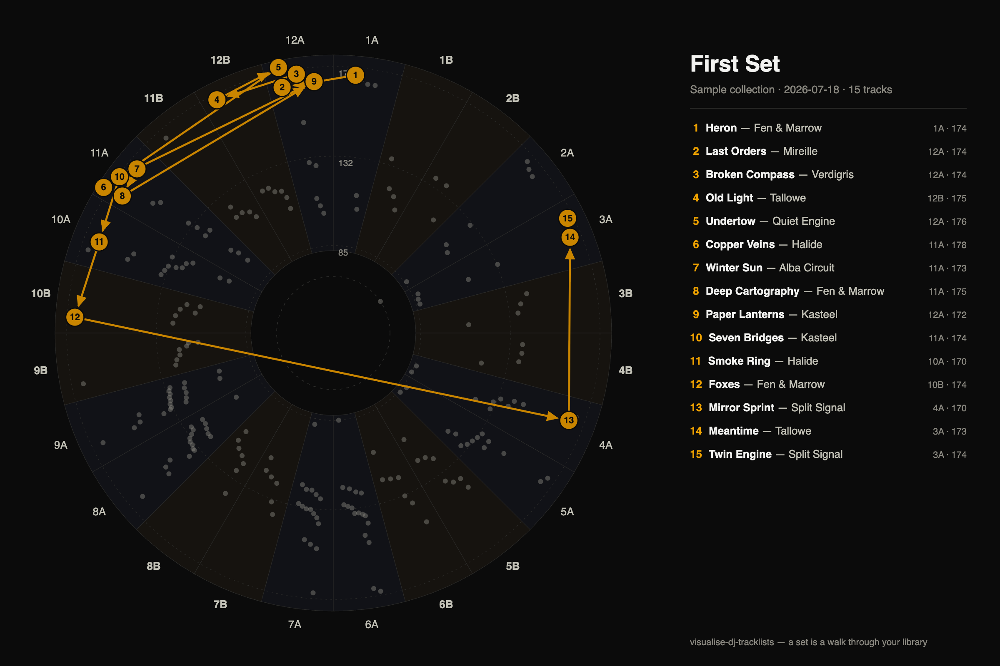
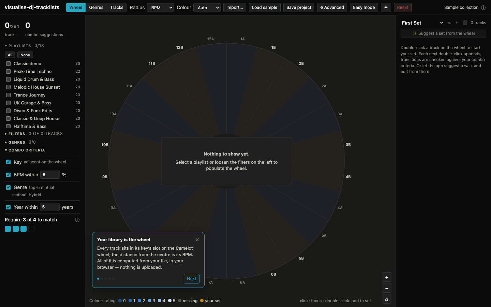

# visualise-dj-tracklists

A local-first web app that shows a DJ library as a **graph** instead of a list: tracks are
nodes on a Camelot-wheel polar view, suggested combos are edges computed from tunable
matching criteria (key adjacency, BPM, genre similarity, year), and a tracklist is a
visible **walk** woven through that structure. It is a map of what you _could_ play,
not a log of what you did.

Your library never leaves your machine — there is no backend, no account, no upload.


## What it does

- **Import** a Rekordbox XML collection export, a **Rekordbox playlist TXT export**
  (the UTF-16 tab-separated table — it becomes the library, a ready-checked playlist
  named after the file, _and_ your set in playlist order), a CSV, tagged audio files
  (ID3/Vorbis/MP4, read in the browser), or an **M3U8 playlist** — M3U8s become your
  set, matched against the library, and entries that aren't in the library yet pick
  up their metadata when you import the collection XML later. The **Load sample**
  button loads one **Sample collection**: eleven themed fictional crates plus the
  classic demo, each as a playlist, behaving exactly like an imported collection —
  including a **Genre Atlas** from jazz to gabber that gives the genre views room
  to shine. The **first sample load opens a five-step guided tour** (the app stays
  interactive under it; replay it any time from the status ⓘ).
- **Work per playlist**: any collection with playlists (XML or the sample) starts
  with an **empty wheel** and a Playlists panel on the left — toggle the playlists
  you want (plus a "Not in a playlist" bucket for the rest) instead of drowning in
  2000 nodes.
- **See the web**: key as angle on a 24-slot Camelot wheel (every harmonically compatible
  key angularly adjacent, minor/major sectors tinted), switchable radius (BPM / rating /
  year), node colour on its own axis. Combo edges draw **around the track you select**:
  its star of compatible neighbours by default, plus the cluster's own interconnections
  with an advanced toggle — an unselected wheel stays a clean constellation (the set's
  walk is always visible). Tracks without a key sit in a labelled gutter at
  their true BPM. Zoom to resolve detail — node disks keep their size while the
  structure magnifies. Node **shapes** (circle, square, triangle, …) carry a class of
  your choosing: **genre families** from the curated genre tree (the default —
  deterministic, and never reshuffled by criterion changes), your selected
  **playlists** (first one wins), or similarity **clusters** in the hybrid space —
  capped by a "max symbol classes" setting (1–8); past the cap, smaller genre
  families **merge into their umbrella** in the tree rather than dropping to
  circles. Playlists have no umbrella to merge into, so a cap below the selected
  playlist count drops the distinction entirely — all circles, no legend — rather
  than showing a misleading partial set.
- **Nodes that hold still**: every track's angle is a property of your _library_,
  not of the current filters — filtering and playlist toggling only make nodes
  appear or disappear, leaving gaps in the same-key fans, so nothing ever shuffles
  around while you narrow down. Same-key tracks **repel each other along their
  slot's arc** — a deterministic relaxation that only separates nodes that would
  actually overlap (radius stays pinned to the value it encodes), squeezes evenly
  when a slot is genuinely full, stays **centred on the key's angle** so a slot's
  weight sits on its line, and is bounded by the spread setting (**0 to 2**:
  0 collapses the fan, 1 is the default ±4° kept well inside the key's sector, and
  2 pushes to the limit — the node's edge just kissing the key's ±7.5° wedge
  boundary, deliberately a little messy). No
  randomness anywhere: the same library always draws the same
  wheel. The one deliberate exception is the **radial axis**:
  tighten the min/max of the value shown as radius and the rings, ticks and radii
  glide to the new range (and back, via each filter's ↺ reset). The legend lists
  only the genre classes you can currently see, and disappears when the symbols
  make no distinction. Rating and year rings only sit on whole values.
- **Map the genres**: a second central view (Wheel | Genres | Tracks switch) lays your
  library's genres out with a force simulation — screen distance approximates the
  distance measure, and you can **grab a genre and move it**: the node pins exactly
  under your cursor while the rest of the map responds only through its own links,
  then everything drifts home when you let go (panning stays on the background; the
  re-layout eases in slowly enough to follow). Node icons here always follow the
  **curated genre families**, with a shape legend at the bottom.
  **One method's edge overlay draws at a time** — it follows your active criterion
  method (drawing exactly the pairs the criterion links, k/threshold included), or
  pick another on the chips; switching never leaves the old overlay stacked.
  **The map rests on a faint skeleton** — each genre keeps only its strongest link,
  dimming as the vocabulary grows; **hover or click a genre** to light up its full
  connections (the wheel's focus rule), and **click two genres to compare them**: a
  docked card locks with every method's score while only the pair's own link stays
  highlighted. A "show nearby genres" toggle ghosts in related genres you don't own
  yet, each tethered to the library genre that summoned it.
- **Browse the tracks**: the third central view is a classic sortable table of
  everything the wheel shows — playlists AND filters scope it — with every column
  sortable (keys in Camelot order, missing values last, ratings as stars), and the
  sort survives view switches. Every track property — **28 of them, everything the
  Rekordbox XML carries**, from Artist to Play count to file Location — has a row
  in the advanced **"Track properties" table** with two checkboxes: **shown as a
  column** here, and **shown as a filter** in the left panel. **Drag the headers**
  to reorder columns; a hidden column remembers its place. Clicking a row selects
  it everywhere and highlights its combo neighbours. Two leading cells: a **single
  star that cycles on click** — essential (must-include) → opener ⏮ → closer ⏭ →
  off, skipping the opener/closer stage when another track already holds it
  (tagged tracks wear a subtle ring on the wheel); and a **＋ cell that appends to
  the set and turns into the track's position number(s)** — hover it for a ✕ that
  takes the track out again. The header ★ (revealed on header hover, aligned over
  the row stars) stars the whole view at once, and a ☰ toggle on the position
  header flips the table to **just this set, in order, with every metadata
  column** — the set panel's list, fleshed out (it disables while the set is
  empty, and the sort triangle hides while set order rules).
- **Filter on anything**: BPM / year / rating ranges show by default; **any other
  property** joins them via the Track-properties table (hiding a filter also
  clears it). Each control matches the **nature** of its field: numeric ranges
  step through their values with the spinner arrows sitting clear of the digits;
  name-like text (artist, title, genre, …) filters by a **first-letter A–Z
  range** — a bounded, ordered domain with a single `#` catch-all bucket for
  non-letter starts, stepped just like BPM, so A–M keeps Kraftwerk and drops ZZ
  Top; free-form fields (**Location**, **Comments**) take a **"contains"**
  substring search; **Colour** is a **chip multi-select** offering only the
  Rekordbox tags present in the selected playlists; and **Kind** collapses to a
  **lossy / lossless / both** quality selector (choose "lossless" to keep only
  the tracks you have a lossless file for). Dates filter by range (undated tracks
  hide while a date filter is active), and the key by **Camelot number** (8–12
  hits both rings), composing with the **both/minor/major** ring switch — the
  excluded ring's sector tint fades out, and narrowing the key range fades away
  the whole angular wedge of each dropped key, so the wheel visibly answers. A
  **Genres section** of its own — a
  checklist **scoped to the selected playlists** with a live count — decides what
  participates in the graph at all. Numeric ranges pre-fill with the whole
  numbers just outside the selected playlists' actual extremes, reset to them
  with a ↺ per range (and whenever you toggle playlists), and a min can never
  cross its max. The filter header counts visible tracks against the playlist
  selection. **Energy** (1–10) joins the filterable properties when your Comments
  carry Mixed-In-Key-style "Energy N" tags — parsed at import, and available as
  the wheel's radius and colour axis too.
- **Tune the criteria**: key / BPM / genre / year each toggleable and ranged (the
  parameters stay editable even while a criterion is switched off); an edge appears
  when at least _N_ of the enabled criteria match, _N_ set with a **row of boxes**
  (fill as many as you require — down to **zero**, where everything connects).
  **Enabling a criterion always requires it** — the bar ticks up by one so the
  thing you just switched on actually counts. Any enabled criterion can also be
  **locked** with a small 🔒: a locked criterion is **demanded** — a hard
  must-match that every combo pair has to satisfy, and it **floors** the require
  count (you can't require fewer matches than the number of things that all must
  match, and a locked box can't be unchecked). For a plain (desired) criterion
  missing metadata never blocks a combo — it just shrinks that pair's denominator
  — but a **demanded** criterion that can't be confirmed on either side forms no
  edge at all. The BPM
  tolerance defaults to **±8%** — the pitch range of a classic
  Technics fader — and goes down to **0% for exact matches**. BPM matches at every
  enabled **metric ratio**: unit time (1:1, on by default — switch it off to isolate
  the exotic combos), **half/double time** (85 ↔ 170), and **2/3 time** (128 ↔ 192,
  triplet ↔ four-on-the-floor). The **+2** and **+7-semitone** key moves toggle
  independently; **vinyl mode** models the physics of beatmatching on turntables —
  pitch shifts the key with the tempo, so keys are always compared _after_ that shift:
  same-key tracks at different tempos detune apart, and clean-semitone gaps transpose
  into new matches. Toggling it visibly rewires the graph.
- **Match genres that aren't spelled the same**: six selectable similarity methods
  (see below) — chosen in the advanced menu (with sourced explainers behind info
  icons), the combo panel showing a subtle note of the active method. The criterion
  defaults to the **hybrid** method
  with **mutual top-k** matching — each genre links to its k nearest genres in
  _your_ library when the closeness is mutual — which self-calibrates across dense
  (electronic) and sparse genre regions; a classic score threshold remains available.
  Umbrella tags ("Electronic", "Dance") never drive a match, and multi-genre fields
  ("House / Techno") match through their best component.
- **Weave a set**: click to focus (a card with the selection's details docks under
  the set panel, and hovering a set row highlights its node on the wheel and its
  table row), double-click to append (the same track can appear twice — just not
  back-to-back), or press the wheel's centre **＋ next** button to slot in the best
  next track (it inserts _between_ tracks when your selection sits mid-set; the
  selection then follows the pick, so pressing again continues from the head). A
  dashed **retry** ring around the hub swaps the last pick for a different one — and
  it never just vanishes: when the matching alternatives run out it morphs into a
  warning-coloured **force retry** with a small **⟲** that restores the original
  pick, and once everything has been tried only the ⟲ remains. When no track matches
  your criteria from there, the hub itself pulses into a **force** state — a forced
  pick gently prefers keys a **±2/±7-semitone move** away — and it greys out once
  every visible track is in the set. **Cmd+Z / Cmd+Shift+Z** undo and redo set
  edits, selection changes **and your settings/criteria tweaks** (a slider drag
  lands as one step; the theme, easy mode and fold state deliberately stay put).
  Plain **1/2/3** switch the central view, and **s** presses ✨ for you.
- **Watch it walk — and mark your own roads**: ✨ **draws the suggested walk
  node by node across the wheel** — each hop lights up as the tracklist cascades
  in sync, a shimmer runs down a full-length walk as it completes, and the button
  throws a little spark burst (long walks compress to ~4 s; everything obeys
  reduced-motion). The selected-track card carries a hands-on tool: **🔗 link
  mode** marks a combo _you_ know works — a dashed, always-visible road that the
  suggester treats like a strong edge and the walk may travel (forward-looking
  planning marks, never a play log). Link mode works from the **wheel and the
  Tracks view** alike, and in focus mode a manual road not touching your
  selection dims with everything else. The app never edits track metadata — key,
  BPM and genre come from Rekordbox and stay read-only here.
- **Keep several sets — they ARE the suggestion browser**: the set panel's header
  shows the **active set's name** over up to **eight named sets** — ＋ counts
  onward from what you have ("Third Set" after two renamed ones), ✎ renames inline
  (clashes auto-suffix to "Name (2)"), and a subtle ✨ badge marks a set that is
  untouched generator output. **✨ Suggest a set from the wheel** regenerates such
  a set **in place** (Cmd+Z steps back through the previous suggestions) and
  starts a **new set** when the current one is hand-edited — your work is never
  overwritten. When the criteria run out before the target length, the button
  morphs into **⚡ Force to N** — it **continues the short walk in place** (keeping
  the tracks already found, not restarting from a new opener), filling the
  remaining steps with the closest rule-breaking picks (still weighted by
  adventurousness) and reporting how many transitions were forced. All sets
  persist with the project.
- **Shape the generated order**: pick the opening/closing track and the essential
  (must-include ★) tracks in the **Tracks view** — the same pins as 📌 on the set's
  first/last rows; with both ends set, the walk grows from both ends inward. An
  essential track is a **hard guarantee**: the generated set _will_ contain it,
  reserving a slot so filler can't crowd it out, trying a harmonious route first
  and **forcing a criteria-breaking edge only as a last resort** — and it never
  loses its place to the adventurousness knob (if you star more essentials than
  the set length, they all still go in). The advanced menu's **Set & suggestions**
  section lists those choices (with ✕ to remove), and sets the **BPM progression**
  — steady, rising, falling, or a sawtooth that builds and drops in cycles — an
  **adventurousness** setting for how much dissonance the generator embraces, and
  a **manual-combo pull** weight that dials how hard the set-builder routes
  through the 🔗 roads you marked (at its default it ranks a marked combo like an
  essential-strength edge).
- **Make it yours**: the advanced settings live in the right panel (swapping with
  the set) as collapsible sections that start folded and **remember what you keep
  open**, so the wheel reacts live while you tune without a wall of controls. The
  **colour scheme** (blue / aqua / violet) tints the whole app — accents, the set
  path, the genre map, even the native checkboxes and sliders — not just the nodes;
  a ☀/☾ switch flips between the dark and light theme (fresh visitors follow the
  system preference), and a **Return to default settings** button at the panel's
  foot resets everything the panel owns — after a confirmation (your filters, sets
  and theme survive). Controls that don't affect the current view **dim but stay
  adjustable**. One **Easy mode** button reduces the whole surface to wheel +
  playlists + ✨ + set, and runs it on **defaults for everything** — default combo
  criteria, no filters, default settings, and no ★/pins/🔗 machinery — completely
  **independent** of your full setup, so easy always looks pristine no matter what
  you tweaked. Your advanced criteria, filters and settings are preserved
  untouched (never mutated, only bypassed), so **All controls** brings every value
  back exactly as you left it; the playlist and the created set stay shared across
  both modes. The top bar stays lean: the imported
  collection's name plus an ⓘ whose tooltip holds the import details **and a
  genre-coverage diagnosis** — how many tracks sit outside the similarity data,
  and which labels top the list (the sample collection raises one too).
  Every ⓘ in the app also **pins open on click** — links inside stay reachable —
  and positions itself to never clip at a panel edge.
- **Take it with you**: export the set as M3U8 (Rekordbox re-imports it) or CSV —
  or as a **set portrait**: the walk over the wheel as a standalone SVG/PNG
  poster, numbered badges on the map and the tracklist down the side, in either
  theme. Save the whole project as JSON — every export asks for a filename first.
  Everything autosaves to the browser; a Reset button (with confirmation) wipes
  the slate. The app is also a **PWA**: install it from the browser and it opens
  like a double-click application, offline included (from the second visit on).






## Where it sits

DJ tooling usually sells visualisation, set-planning, and track suggestion as three
separate products; this app is the synthesis of all three, built around one idea no
established tool ships: the **whole library drawn as a graph on the Camelot wheel,
with the set as a visible walk through it**. Set-builders like DJ.Studio or Mixgraph
show a timeline or a scored slot list; rekordbox's Related Tracks shows a ranked
list; library managers show tables. Here the answer is a shape you can see and steer.

It is deliberately **not** a key/BPM analyzer (it reads what Rekordbox already
computed), not a library manager or converter (Lexicon does that better), and not
performance software — it is the thinking tool you open _before_ the gig.

Two more things set it apart. Everything is **explainable**: every edge exists
because of criteria you set and can read, every genre score can be inspected per
method — no black-box "AI chemistry" numbers. And everything is **local**: when the
Spotify audio-features API shut down in 2024 it froze or killed the tools built on
it; nothing here can break that way, because nothing leaves your machine.

One boundary is a hard non-goal: **this app plans, it doesn't remember**. It will
never log the transitions you actually played or keep a play history — the roadmap's
"DJ fingerprints" analyse tracklists you _import_, they never record you. If you
want a memory for the combos you've played and loved, that is exactly what
[Mixlog](https://mixlog.app) is for — a logbook for your DJ brain, and the perfect
complement: Mixlog remembers the transitions you played; this draws the map of the
ones you could.

The full landscape analysis, differentiation, and brand notes live in
[docs/POSITIONING.md](docs/POSITIONING.md) (source research in
[docs/research/](docs/research/)).

## Genre similarity

"Tech House" and "Techno" are different strings but not unrelated music. The genre
criterion supports six methods (picked in the combo panel; parameters and sourced
explainers in advanced menu → Genre matching), implementing the
recommendations of a literature review on genre distance measures
([docs/designs/design-v4.md](docs/designs/design-v4.md) has the design; the research
reports live in [docs/research/](docs/research/), and
[docs/science/genre-distance-measures.md](docs/science/genre-distance-measures.md)
documents the technical choices, the evidence behind them, and the open questions):

| Method             | How it works                                                                                  | Data                                                              | Grounding                            |
| ------------------ | --------------------------------------------------------------------------------------------- | ----------------------------------------------------------------- | ------------------------------------ |
| Exact              | normalized labels must be identical (aliases like DnB → Drum & Bass still unify)              | none                                                              | Schreiber 2015 (tag normalization)   |
| Lexical            | token-set Jaccard after normalization ("melodic house" ~ "house")                             | none                                                              | —                                    |
| Graph              | decay^(shortest path) over a curated genre-relation graph                                     | [src/data/genre-graph.json](src/data/genre-graph.json) — editable | Rada et al. 1989                     |
| Taxonomy           | Lin similarity over a rooted genre DAG with intrinsic information content                     | [src/data/genre-tree.json](src/data/genre-tree.json) — editable   | Lin 1998; Seco et al. 2004           |
| Embedding          | mutual-proximity-corrected similarity between tag co-occurrence embeddings                    | [src/data/genre-embedding.json](src/data/genre-embedding.json)    | Levy & Goldberg 2014; Schnitzer 2012 |
| Hybrid _(default)_ | the embedding retrofitted toward the curated tree — data plus lineage, best subgenre coverage | same pack, `hybrid` section                                       | Epure et al. 2020 (retrofitting)     |

The bundled pack is built from the
[MediaEval AcousticBrainz Genre Dataset](https://mtg.github.io/acousticbrainz-genre-dataset/)
(ground-truth annotations for ~2 million recordings from Discogs, Last.fm and Tagtraum;
**CC BY-NC-SA 4.0** — the pack is a derived work, so it inherits the non-commercial
share-alike terms). Pipeline: label co-occurrence → PPMI (rare-pair noise floor) →
**truncated SVD** (d=32, chosen by sweeping dimensions against a built-in triplet eval) →
cosine → **Mutual Proximity** (hubness fix) → per-label top-20 neighbour lists, umbrella
tags damped. The hybrid section retrofits the embedding toward
[genre-tree.json](src/data/genre-tree.json), which also gives tree-only club genres
(liquid drum & bass, melodic techno, …) usable vectors — it scores 100% on the triplet
eval vs the plain embedding's 91%. To rebuild:

```sh
# download the three open *-train.tsv.bz2 ground-truth files from
# https://zenodo.org/records/2553414 into data/acousticbrainz/ and bunzip2 them
node scripts/build-genre-embedding.mjs --from-acousticbrainz data/acousticbrainz
node scripts/build-genre-embedding.mjs --from-acousticbrainz data/acousticbrainz --sweep  # dimension sweep
node scripts/build-genre-embedding.mjs   # graph-diffusion starter pack instead
```

Unknown labels fall back to lexical similarity in the graph, taxonomy, embedding and
hybrid methods.


## Development

```sh
npm install
npm run dev      # start the app
npm test         # unit tests (keys, combos, genre, filters, importers, exporters, suggest, sets, history, persistence, samples)
npm run lint     # eslint + prettier check
npm run check    # svelte-check + tsc
npm run build    # production build
node scripts/screenshot.mjs out/   # drive the app headlessly through every flow (needs dev server)
```

The core (`src/core/`) is pure TypeScript with no DOM or Svelte imports — the graph
logic is reusable and fully unit-tested. The Svelte components in `src/lib/` are a thin
view layer over it.

## Deploy

The app is a fully client-side static bundle — no backend, database, or secrets — so it
can be hosted on any static host. It is published to **Cloudflare Pages** via git
integration: every push to `main` triggers a build and deploy, and pull requests get
preview URLs automatically.

| Setting | Value |
| --- | --- |
| Build command | `npm run build` |
| Build output directory | `dist` |
| Node version | `20` (pinned in `.nvmrc`; also set `NODE_VERSION=20` in the Pages env) |

`public/_headers` keeps `sw.js` and `index.html` revalidated so updates ship promptly,
while hashed `assets/*` stay immutably cached. No SPA `_redirects` fallback is needed —
the app is a single mount with no client-side routes.

## Background & roadmap

The concept — track set graphs, track vector walks, and DJ "fingerprints" as statistics
over walks — is laid out in the concept paper at
[docs/visualise-dj-tracklists.pdf](docs/visualise-dj-tracklists.pdf); the v1 design and
decisions live in [docs/designs/](docs/designs/); positioning against the wider
DJ-tool landscape (and the naming shortlist) lives in
[docs/POSITIONING.md](docs/POSITIONING.md).

Planned next (in rough order): walk-quality metrics (the first step toward DJ
fingerprints), weighted edges with per-criterion weight sliders, force-layout "free"
view for _tracks_ (the genre map already ships the d3-force groundwork),
insert-between-via-edge-drag, keyboard navigation in the Tracks view (arrows +
Enter now that the ＋ cell exists), Rekordbox-XML playlist export, a 3D "set
journey" tunnel view, opt-in local audio analysis (Essentia.js), and fingerprint
analytics over imported tracklists.
